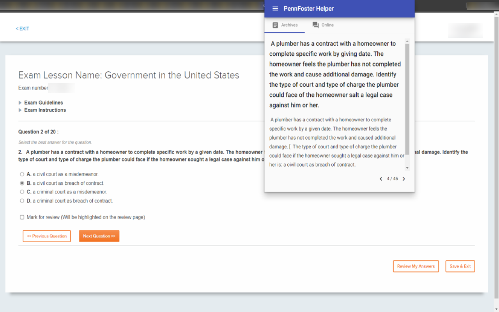

# PennFoster Helper

A Chrome Extension to detect PennFoster exam questions and search for answers from Weegy.



## Project Structure

The folder _pennfoster-helper.server_ has been deprecated.  
The main parts locates at _pennfoster-helper.client/projects/browser-extension_.

## Development

```sh
git clone https://github.com/TheNightmareX/pennfoster-helper
cd penn-foster-helper.client
npm i
npx ng build --watch
```

While the initial HTML generated by Angular cannot pass the enforced Content Security Policy, we need to run a script to adjust the `index.html` after each build. We shall open another terminal to run the script when using `ng build --watch`:

```sh
node projects/browser-extension/scripts/csp.js
```
